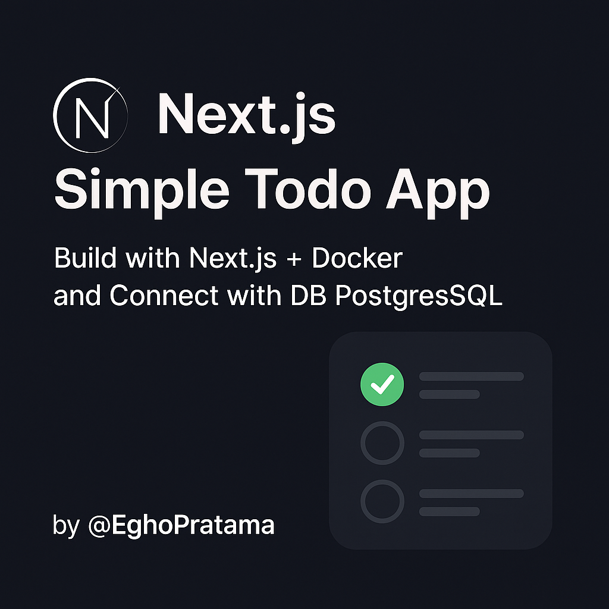

# 📝 Next.js Simple Todo App

[](https://www.docker.com/)
[](https://www.postgresql.org/)
[](https://nextjs.org)



A simple fullstack Todo application built using **Next.js (App Router)** with Docker and connected to a **PostgreSQL** database.

---

## 🚀 Features

- 🧱 Built with Next.js App Router
- 🐳 Dockerized frontend & backend
- 🗃️ PostgreSQL integration
- 🔐 JWT Authentication
- 🧩 Role-based access control
- ☑️ Todo CRUD operations
- 🧪 State management Zustand

---

## 🛠️ Getting Started

### 1. Clone the Repository

```bash
git clone https://github.com/EghoPratama/nextjs-todo-app.git
cd nextjs-todo-app
```
### 2. Run with Docker

```bash
docker-compose up --build
```

## 👨‍💻 Author

Created by [@EghoPratama](https://github.com/EghoPratama)  

---